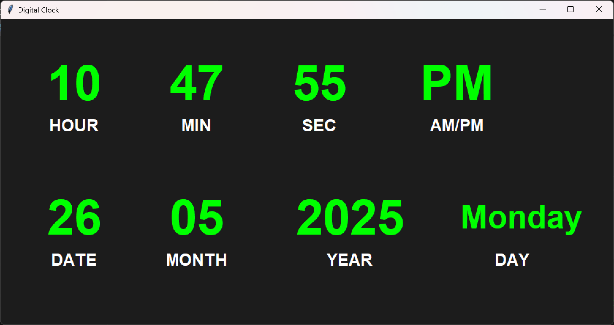

# 🕒 Digital Clock GUI in Python

This is a graphical **Digital Clock** built using Python's `tkinter` library.<br>
It displays the **current time (hours, minutes, seconds, AM/PM)** and the **date (day, date, month, year)** in a user-friendly and stylish interface.

 

---

## 🧰 Features

* Live time display with:

  * Hours, Minutes, Seconds
  * AM/PM indicator
* Real-time date:

  * Day of the week
  * Date, Month, Year
* Colorful, modern UI using `Tkinter`
* Auto-updates every second
* Easy to run and customize

---

## 🖥️ Preview

| Time & AM/PM              | Date & Day                     |
| ------------------------- | ------------------------------ |
| ✅ Hours, Minutes, Seconds | ✅ Day, Date, Month, Year       |
| ✅ Bold, large fonts       | ✅ Stylish green-on-black theme |


---

## 📝 Customization

* You can change font styles, colors, sizes, or layout positions by modifying the values in:

  ```python
  label_style = {"font": ("Arial", 60, "bold"), "bg": "#1C1C1C", "fg": "#00FF00"}
  ```

* To show short day names (e.g., Mon instead of Monday), change:

  ```python
  day = time.strftime('%A')
  ```

  to:

  ```python
  day = time.strftime('%a')
  ```

---

## 🙌 Author

Made with ❤️ by <br>
Akarsh Kumar
